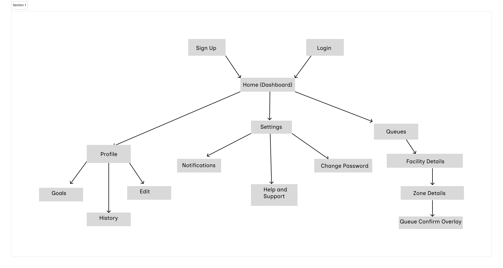
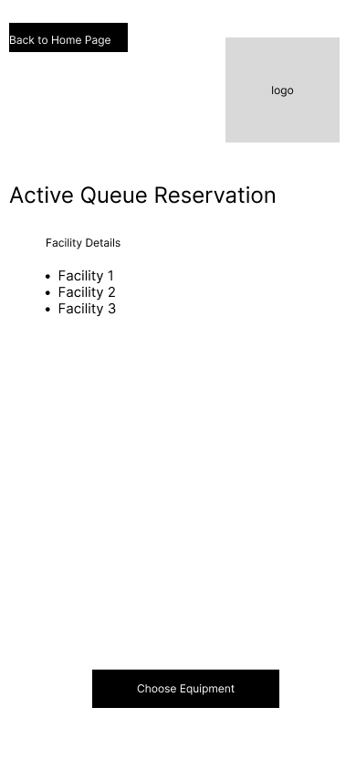
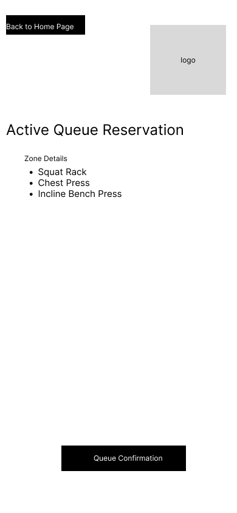
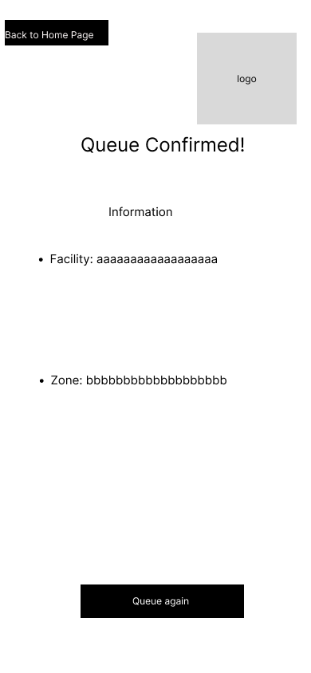

# User Experience Design

The following document presents the UX design for **SmartFit**, a mobile-first fitness companion app that helps users manage workouts, track goals, and optimize gym sessions.  
These wireframes and the app map illustrate the Minimum Viable Product (MVP) flow and core user interactions, designed collaboratively in Figma.

---

## App Map  
[App Map Source](https://www.figma.com/design/eUh8SgREd1709DvDteNzJg/SmartFit?node-id=0-1&p=f&t=o69TJ5Yq3QLxWdIT-0)

The App Map below shows the primary navigation flow of SmartFit.  
Users begin by either registering a new account or logging in to an existing one. Both paths lead to the Home Page (Dashboard), which serves as the central hub for navigation.

From the Home Page, users can access the following sections:

* **Profile** – Manage personal details, track goals, and view workout history.  
  * **Goals** – Create and monitor personal fitness goals.  
  * **History** – Review workout history, gym locations visited, and muscle groups worked.  
  * **Edit Profile** – Update name and email information.
* **Settings** – Manage notifications, support options, and account security.  
  * **Notifications** – View the list of all app alerts and queue notifications.  
  * **Help & Support** – Access FAQs or report an issue.  
  * **Change Password** – Update account password.
* **Queues** – Join or manage queues for gym equipment.  
  * **Queue Confirmation Page** – Displays confirmation details after joining a queue.  
  * **Queue Confirmed Page** – Confirms the user’s active queue status.

---

---

## Wireframes  
[Wireframe Source](https://www.figma.com/design/eUh8SgREd1709DvDteNzJg/SmartFit?node-id=1-2&p=f&t=fHRFMwlpmVcyj1Ax-0)

### Register
  

Allows new users to create an account by providing basic information such as email and password.
Includes a link to navigate back to the **Log In** screen.

---

### Log In
  

Enables users to access their account with their email and password.  
Provides an option to navigate to the **Register** screen for new users.  
Upon successful login, users are directed to the **Home Page**.

---

### Home Page / Dashboard
  

Acts as the main hub of the app.  
Displays a quick overview of the user’s current activity, progress highlights, and shortcuts to **Profile**, **Settings**, and **Queues**.  
Users can navigate seamlessly to track progress, manage preferences, or join equipment queues.

---

### Profile Page
  

Centralizes all user-specific information. Displays the user’s name and email address. 
From here, users can navigate to:
- **Goals** – to create or update personal fitness targets.  
- **History** – to view previous workouts, gym visits, and muscle groups worked.  
- **Edit Profile** – to modify name and email details.

---

### History Page
  

Presents a detailed timeline of the user’s past workouts.  
Includes key metrics such as exercise type, duration, muscle groups targeted, and gym location.  
Each entry can be expanded for more detailed statistics.

---

### Facilities Page
  

Allows users to **join a queue** for gym equipment during busy periods.  
Displays current queue length, estimated wait time, and a button to join.  
After joining, users are taken to a **Queue Confirmation Page**.

---

### Zones Page
  

Shows a summary of the queue details (equipment, position, and estimated wait time).  
Includes a button to confirm queue participation, which leads to the **Queue Confirmed Page**.

---

### Confirmed Queue Page
  

Confirms successful queue entry.  
Displays the user’s current position in the queue and updates dynamically as the queue progresses.

---

### Settings Page
  

Provides access to app customization and account management options.  
From here, users can access:
- **Notifications** – to view alerts and queue updates.  
- **Help & Support** – to read FAQs or report technical issues.  
- **Change Password** – to securely update their login credentials.

---

## Prototype  
[Figma Prototype](https://drive.google.com/file/d/1FMhS7xDhgmuMihDU3S4zjzRaS2dg5zBO/view?usp=sharing)
