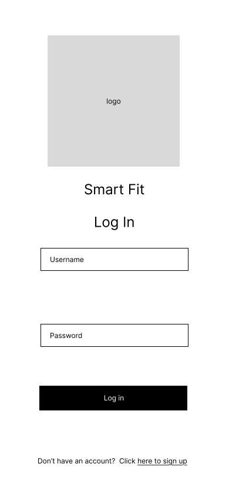
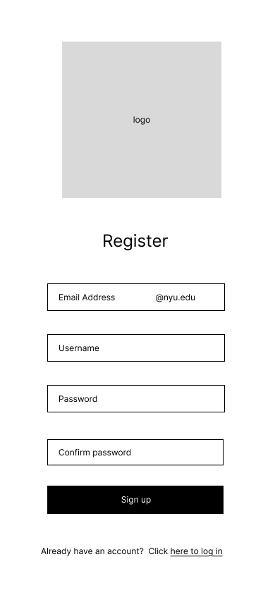
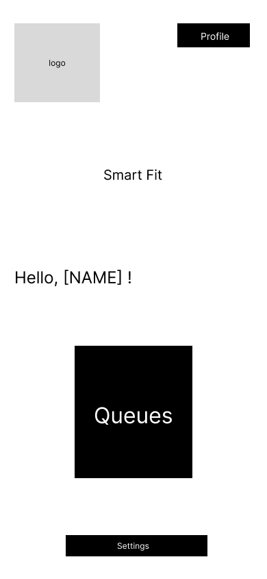
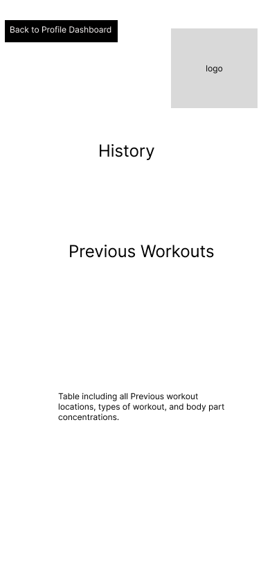
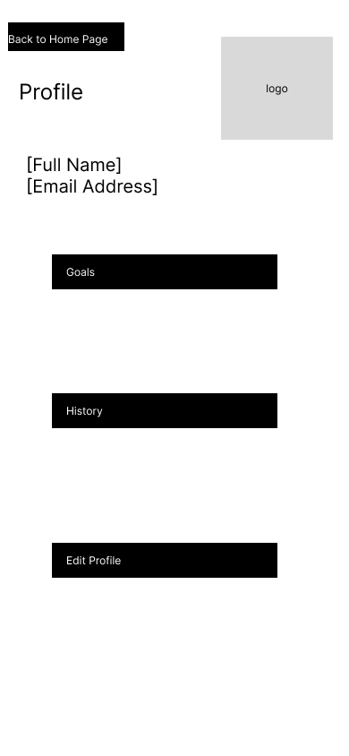

# User Experience Design

The following document presents the UX design for **Smart Fit**, a mobile-first fitness companion app that helps users manage workouts, find partners, and optimize gym sessions.  
These wireframes and the app map illustrate the Minimum Viable Product (MVP) flow and main user interactions, designed collaboratively in Figma.

---

## App Map

The App Map below shows the primary navigation flow of **Smart Fit**.  
Users begin by either registering a new account or logging in to an existing one, both of which lead to the Dashboard/Home Page. From there, users can explore several core features:

* **History** – Review previous workouts, including sets, reps, duration, and calories burned.
* **Queues** – Join or monitor a queue for specific gym equipment.
* **Profile** – View personal fitness data and edit key metrics.
* **Settings** – Update preferences, account details, and app configurations.

---

## Wireframes

### Log In
  

Allows users to access their account using email/username and password. Includes a link to the **Register** screen for new users.  
Upon successful login, users are directed to the **Dashboard/Home Page**.

---

### Register
  

Enables users to create a new account by entering essential information such as username, password, and fitness preferences.  
Includes a link to return to the **Log In** screen.

---

### Dashboard / Home Page
  

Serves as the main hub of the app. Displays an overview of today’s workout summary, quick links to **History**, **Queues**, and **Partners**, and motivational statistics like streaks or active minutes.  
Users can also navigate to **Profile** and **Settings** from here.

---

### History Page
  

Displays a chronological list of previous workouts with key stats (exercise type, duration, sets/reps, and calories).  
Users can tap on any session to view a detailed summary.

---

### Partners Page
  

Connects users with other gym-goers looking for partners.  
Includes options to:
- **Find a Partner:** Search based on gym location or workout goals.  
- **Partner Match:** View automatically generated matches and request to connect.

---

### Queues Page

  

Allows users to **join a queue** for gym equipment or facilities when the gym is busy.  
Displays current queue length, estimated wait time, and a “Join/Leave Queue” button.  
After joining, users can monitor their queue position in real time.

---

### Profile Page
  

Shows user information such as name, photo, fitness goals, and current statistics.  
Users can navigate to **Edit Profile** or return to the **Dashboard**.  
Provides a quick snapshot of fitness milestones and gym achievements.

---

### Settings Page
  

Allows users to customize app preferences, notification settings, and account details.  
Includes actions such as “Edit Info,” “Change Password,” and “Log Out.”

---

## Prototype
[Figma Prototype](https://www.figma.com/design/eUh8SgREd1709DvDteNzJg/SmartFit?node-id=0-1&t=fUfldpbwr77553CX-1/)
